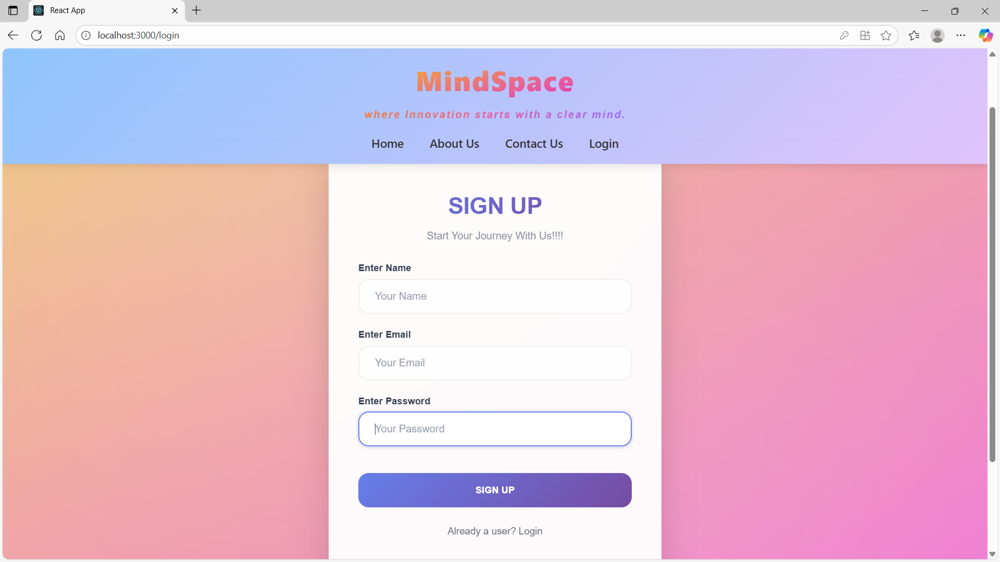

# Mindspace

Mindspace is a full-stack wellness platform designed to help users track their mood, gain insights and stay mindful.  
This README explains the application architecture, each major page’s functionality and setup instructions.

---

## 📂 Project Overview
Mindspace is built with a **React** frontend and a **Spring Boot** backend. 

Key features include:

- Secure authentication and protected routes  
- RESTful APIs for user management and mood tracking  
- Responsive, mobile-friendly UI  

---

## 🏠 Homepage
The homepage is the welcoming entry point.

**Non-technical**  
- Presents a clean, calming design to encourage a positive first impression.  
- Highlights core features such as mood tracking, insights and personalized dashboard.  
- Provides quick navigation to signup/login and information sections.

**Technical**  
- Built with React functional components and CSS for responsive layout.  
- Fetches featured content from the backend via a REST API.  
- Uses React Router for seamless navigation without page reloads.


---

## ℹ️ About Us Page
**Non-technical**  
- Shares the story, mission and team behind Mindspace.  
- Builds trust and explains the purpose of the application.

**Technical**  
- Static content served as a React page with markdown-like rich text.  
- Responsive grid layout ensures readability on all devices.  
- No backend calls, enabling quick load times.


---

## 📞 Contact Us Page
**Non-technical**  
- Provides a simple form for users to send feedback or questions.  
- Includes email links for direct communication.

**Technical**  
- React form with controlled components for real-time validation.  
- POSTs data to a Spring Boot endpoint that stores messages in a database.  
- Form input is sanitized and validated on both client and server.


---

## 🔑 Signup / Login Page
**Non-technical**  
- Allows users to create an account or securely log in.  
- Offers clear feedback on success or failure (e.g., wrong password).

**Technical**  
- React + Context API for managing authentication state.  
- Communicates with backend `/api/auth` endpoints using JWT for secure sessions.  
- Passwords are hashed using Spring Security’s `BCryptPasswordEncoder`.  
- Includes client-side validation and protected routes.





---

## 📊 Dashboard Page
**Non-technical**  
- Personalized hub showing a summary of user activity and quick links to key features.  
- Displays daily mood logs, quick insights and motivational content.

**Technical**  
- React dashboard uses reusable components and charts (e.g., Chart.js).  
- Fetches user-specific data via authenticated REST calls.  
- Implements lazy loading to optimize performance.


---

## 🌈 Mood Insights Page
**Non-technical**  
- Lets users record moods and view trends over time.  
- Provides suggestions or mindfulness tips based on mood history.

**Technical**  
- Interactive forms and dynamic data visualization (e.g., line/bar charts).  
- Backend stores mood entries in a relational database (MySQL).  
- Insights generated using simple analytics (average mood score).  
- Protected route ensures only authenticated users can access their data.


---

## 🛠️ Tech Stack
- **Frontend**: React, CSS, Axios, React Router  
- **Backend**: Spring Boot, Spring Security, JPA/Hibernate  
- **Database**: MySQL   

---

## 🚀 Getting Started
### Prerequisites
- Node.js ≥ 18  
- Java ≥ 17   
- MySQL server

### Setup
1. Clone the repo  
   ```bash
   git clone https://github.com/shruti0731/mindspace.git
   cd mindspace
   ```

2. **Backend**  
   ```bash
   cd api
   mvn spring-boot:run
   ```

3. **Frontend**  
   ```bash
   cd mlogin
   npm install
   npm start
   ```

4. Access the app at `http://localhost:3000`.

---

## 📸 Screenshots

**- Dashboard**


---


---

**- Profile**
  


---

**- Apply search filters by date, mood, content,etc.**
  


---

**- Resource Recommendations**


---


---

**- Mood insights**


---


---

## Author
Shruti Chavan.
